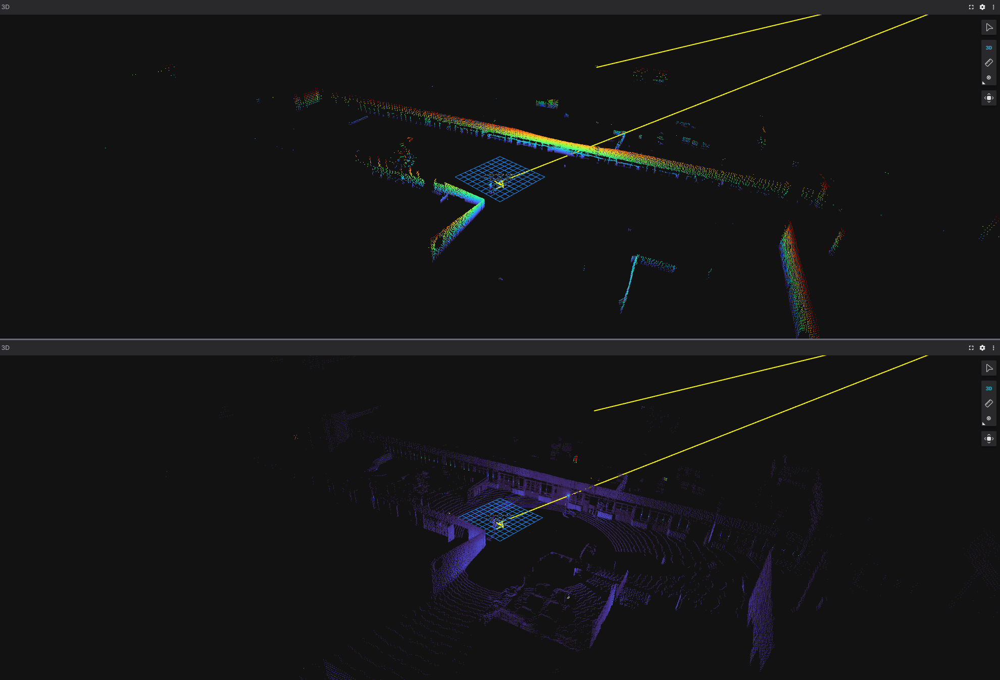

# `nag_agk_ajr` package
ROS 2 python package.  [](https://docs.ros.org/en/humble/)
A package egy nodeból áll. A `/lexus3/os_center/points` topic-ról kapott értékeket filterezi `0.2` és `4.0` értékek között. Ezeket a szűrt értékeket a `/lexus3/os_center/filtered_points` topic-on hirdeti.
## Packages and build

It is assumed that the workspace is `~/ros2_ws/`.

### Clone the packages
``` r
cd ~/ros2_ws/src
```
``` r
git clone https://github.com/Ngy-Gergo/nag_agk_ajr.git
```

### Build ROS 2 packages
``` r
cd ~/ros2_ws
```
``` r
colcon build
```

<details>
<summary> Don't forget to source before ROS commands.</summary>

``` bash
source ~/ros2_ws/install/setup.bash
```
</details>

``` r
ros2 launch nag_agk_ajr filter.launch.py
```
# Flow chart

flowchart TD
```mermaid
    A[/center_lidar/]:::node --> B[/lexus3/os_center/points/]:::topic
    B --> C[/filter/]:::node
    C --> D[/lexus3/os_center/points_filtered/]:::topic

    classDef node fill:#ff7b7b,stroke:#ff7b7b,color:#fff,fontWeight:bold;
    classDef topic fill:#4ee3ff,stroke:#4ee3ff,color:#000,fontWeight:bold;
```
# Reference Image


<p align="center"></p>